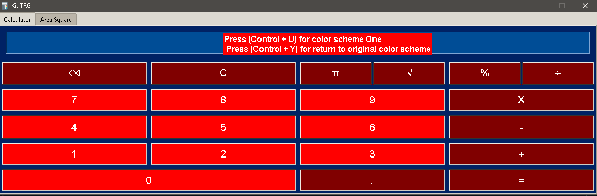
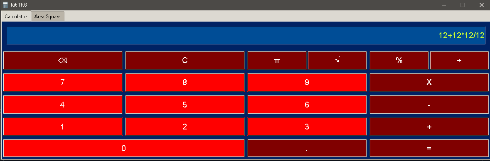
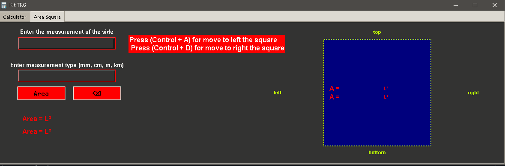
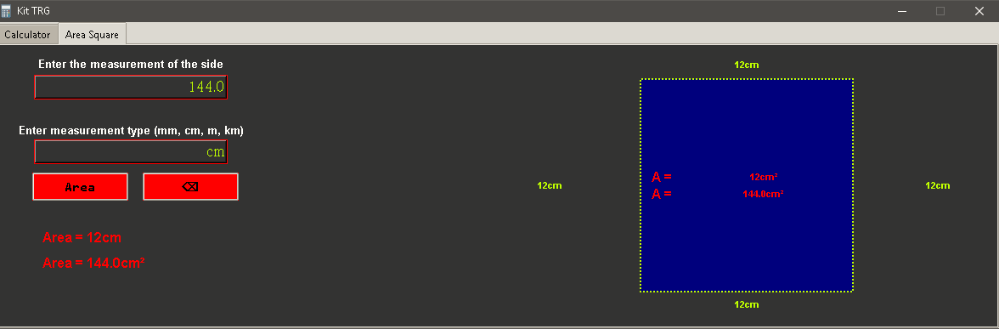
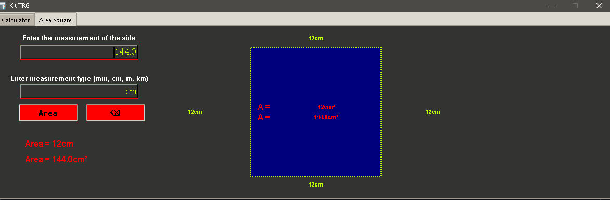
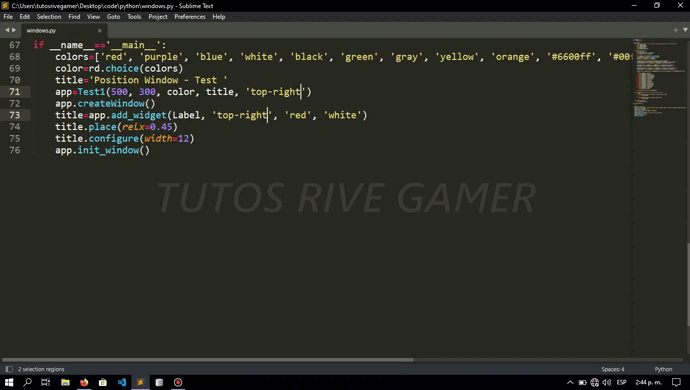
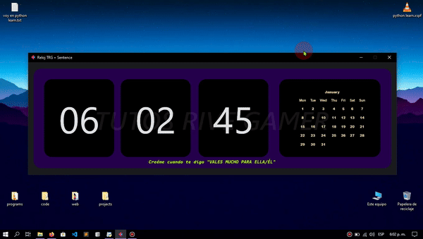

# TRG Python

## Contenidos

<ul style="font-weight:600; font-family:monospace">
<li>Conteo de clicks (Pyautogui) (<a href="Python/click.py">Click</a>)</li>

<li>Comparación de dos números. (<a href="Python/comparation.py">Click</a>)</li>

<li>Recolección de datos. (<a href="Python/datos.py">Click</a>)</li>

<li>Bucle for (<a href="Python/loop_for.py">Click</a>)</li>

<li>Definir si una persona es mayor o menor de edad. (<a href="Python/mayor-menor-edad.py">Click</a>)</li>

<li>Tkinter things. (<a href="Python/Prompt-Tkinter-1.py">Click</a>)</li>

<li>Pyautogui (<a href="Python/pyautogui.py">Click</a>)</li>

<li>Suma de dos variables. (<a href="Python/suma-1.py">Click</a>)</li>

<li>Ventana vacía de Tkinter. (<a href="Python/tkinter-2.py">Click</a>)</li>

<li>Abrir otro archivo con open. (<a href="Python/TKINTER-PROGRAM.py">Click</a>)</li>

<li>Ventana de ensayos Tkinter. (<a href="Python/Tkinter.py">Click</a>)</li>

<li>Cambiar color de la ventana Tkinter. (<a href="Python/tkinter2.py">Click</a>)</li>

<li>Contar clicks en ventana Tkinter (<a href="Python/tkinter3.py">Click</a>)</li>

<li>Obtener texto de un Entry. (<a href="Python/suma-1.py">Click</a>)</li>

<li>Saludar a alguien. (<a href="Python/tKinterr.py">Click</a>)</li>

<li>While. (<a href="Python/web-trg.py">Click</a>)</li>

<li>Gues Number. (<a href="Python/guessnumber/gamemain.py">Click</a>)</li>

<li>Posicionate window Tkinter with this script. (<a href="Python/windows.py">Click</a>)</li>
</ul>

## Calculadora

Mi actual proyecto es una calculadora, es el archivo o por decirlo, el programa más completo que tengo es este, consta de un diseño simple con la ayuda del Framework de Tkinter de python.

### Primer resulado

### Resultado final

By TRG (2023)

# Kit TRG 1.0.0 (<a href="Python/Kit TRG/ventanas.py">Click</a>)

  
  

Este nuevo proyecto, es un pequeño programa de pestañas ttk.Notebook, dentro hay dos pestañas, la principal es una calculadora básica y la segunda pestaña ayuda a obtener el área de un cuadrado, además de mostrar ilustracion de este, y mostrar las medidas en este.

## Funcionalidades

- Calculadora básica: Realiza operaciones aritméticas simples.
- Cálculo de la raíz cuadrada de un cuadrado: Realiza el cálculo de la raíz cuadrada de un número al cuadrado.

## Capturas de Pantalla

### Preview 1 Calculator

  
  
  

  
  ### Preview 2 Calculator
  

    
  
  

  
  ### Preview 1 Area Square
  

      
  
  

  
  ### Preview 2 Area Square
  

        
  
  

   
   ### Preview 3 Area Square
   

          
  
  

  
  ### Preview 4 Area Square
  
  
  
  
  

  
  ### Functionality
  

  
  

  ### Preview windows.py
  

    Posiciona ventanas con ayuda de tkinter y este script.
    
  

  ### Preview reloj.py
  

    Un simple reloj, cada 5 segundos muestra en pantalla una frase, al igual que un calendario (del mes actual), obviamente la hora, además es minimalista.
    
  

  
## Instalación

Describe aquí los pasos para instalar y ejecutar el programa en el sistema del usuario.

1. Clona el repositorio: `git clone https://github.com/tu_usuario/tu_proyecto.git`
2. Navega al directorio del proyecto: `cd tu_proyecto`
3. Instala las dependencias: `pip install -r requirements.txt`
4. Ejecuta el programa: `python ventanas.py`

Asegúrate de tener instalada la última versión de Python y las dependencias necesarias.

## Contribuciones

¡Las contribuciones son bienvenidas! Si deseas colaborar en el proyecto, sigue los siguientes pasos:

1. Haz un fork del repositorio.
2. Crea una rama para tu contribución: `git checkout -b feature/nueva_funcionalidad`
3. Realiza los cambios y commitea tus modificaciones: `git commit -m "Agrega una nueva funcionalidad"`
4. Envía tus cambios al repositorio remoto: `git push origin feature/nueva_funcionalidad`
5. Abre una pull request en GitHub y describe tus cambios en detalle.

## Autor

Tutos Rive Gamer
tutosrivegamer@gmail.com

## Agradecimientos

Agradece aquí a las personas que te han apoyado en el desarrollo del proyecto, a la comunidad de código abierto, etc.

## Apoya el Proyecto

Si encuentras útil este proyecto y te gustaría apoyarlo, considera realizar alguna de las siguientes acciones:

- Comparte el proyecto con tus amigos y colegas.
- Contribuye al proyecto mediante pull requests.
- Realiza una donación para ayudar a mantener y mejorar el proyecto.
- Escribe una reseña o calificación positiva en la página del proyecto.

¡Tu apoyo es muy importante y me motiva a seguir trabajando en el proyecto!
