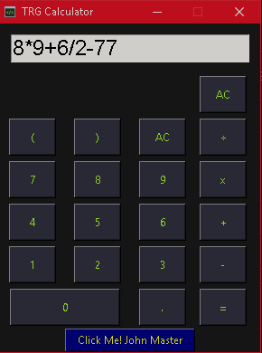

# TRGamer_Python

# ¿Cuál es el propósito de este repositorio?

El prpósito es subir y almacenar mis proyectos personales de Python en este.

Para acceder a ellos demanera rápida.

## **Mira mi calculadora Python**

  

[Calculadora Python By TRG (Instalador)](EXE/)

[Código fuente](Python/calculadora/index.py)
